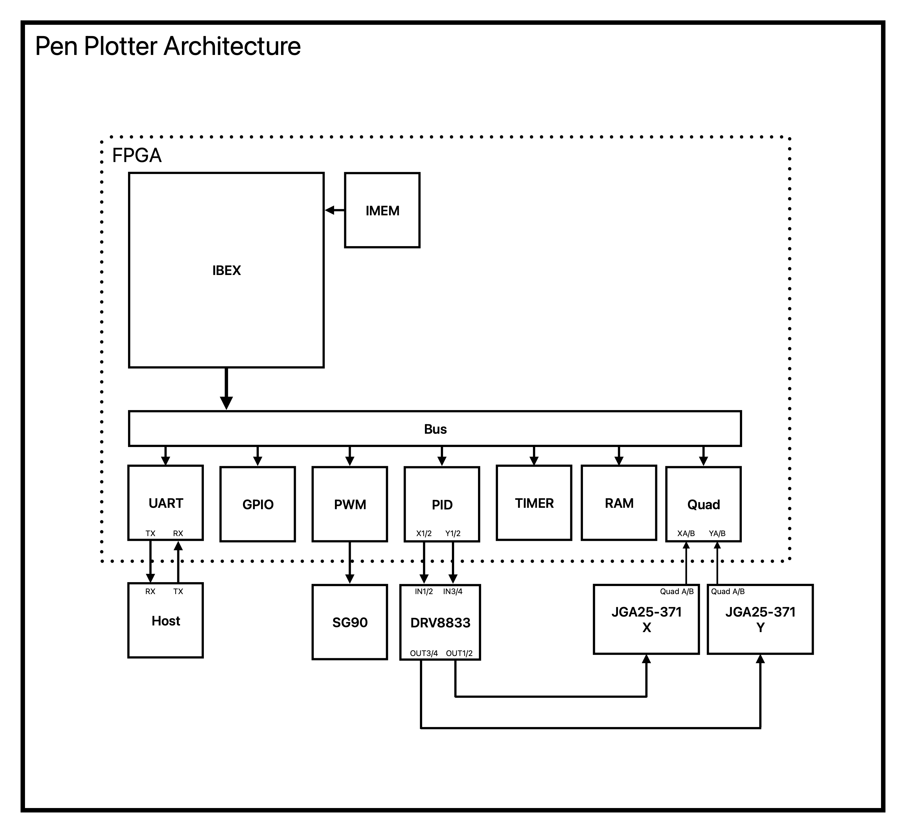
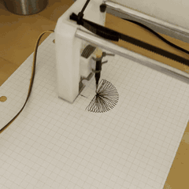

# Pen Plotter

This is an in-progress RISC-V SoC used to control a closed-loop pen plotter that I built.

It uses the [Ibex](https://github.com/lowrisc/ibex) core connected over an OBI interconnect to control the peripherals needed for the plotter. These include a UART TX/RX buffer, two PD controllers (called PID), two quadrature decoders, a programmable PWM generator, and a system timer.

<p align="left">

</p>

[Phase 3A Design Notes](https://icy-tee.github.io/blog/pen-plotter/phase3a/)

<p align="left">
  
  <br>
  <em><code>dv/verilator/shape.c</code> communicating with firmware running on the Ibex core.</em>
</p>

## Quickstart

Ensure Verilator, `srec_cat` and a RISC-V 32-bit toolchain ([lowrisc's](https://github.com/lowRISC/lowrisc-toolchains/releases/tag/20251111-1)) are installed.

```sh
  git clone https://github.com/icy-tee/pen-plotter.git
  cd pen-plotter

  python3 -m venv .venv
  source .venv/bin/activate
  pip install -r python_requirements.txt

  make sim

  mkfifo /tmp/uart_rx /tmp/uart_tx # only needed if pipes don't exist

  ./build/icytee_soc_plotter_0/sim/Vtop_verilator --piped --cycles 5000000000
```

In another shell:
```console
  $ ./build/ppcsender sim /tmp/uart_rx /tmp/uart_tx
  setKp 0.5
  setKd 0.5
  setRd 7
  go 1000 1000
  quit
```

The Verilator model simulates motor movement and quadrature feedback and is configured via the `ppcsender`. Upon reaching the `SETPOINT` it sends a `STABLE` packet to the `ppcsender`.

## Running

### Prerequisites

|Flow|Platform|Requirements|
|----|----|--------|
|Verilator Simulation|Linux| Verilator, [RISC-V 32-bit toolchain](https://github.com/lowRISC/lowrisc-toolchains/releases/tag/20251111-1), `srec_cat`|
|Quartus Synthesis|Linux| Quartus Prime Pro 26.1, [RISC-V 32-bit toolchain](https://github.com/lowRISC/lowrisc-toolchains/releases/tag/20251111-1), `srec_cat`|
|UVM|Linux| Questa|


### Simulation

A Verilator simulation can be run through `make sim`, which also compiles and updates the program files when
their tracked inputs change.

The simulation accepts a `--cycles N` flag to set its run length. When omitted, the default is 6,000,000
cycles, which allows the first timer interrupt to occur.

It also accepts a `--piped` flag to use `/tmp/uart_tx` and `/tmp/uart_rx` (named pipes) as the UART lines. This is used to simulate behavior with `dv/verilator/ppcsender.c` and `dv/verilator/shape.c`.

### Verification

Currently, QuestaSim is the only supported verification simulator.
The current UVM testbenches can be run directly with `fusesoc`:
  - `fusesoc --cores-root=. run icytee:dv:obi_uart_tb`
  - `fusesoc --cores-root=. run icytee:dv:obi_reg_tb`
  - `fusesoc --cores-root=. run icytee:dv:obi_bus_tb`

They can also be run via `make` using the `uvm-uart`, `uvm-reg`, or `uvm-bus` rules.

### Synthesis

Synthesis now runs for Quartus targeting the DE23-Lite:

Running `make quartus` runs the `fusesoc` setup for a Quartus project and then uses `quartus_sh` to start the flow. 

It uses `sw/vmem_to_mif.py` to convert the `.vmem` to the Quartus-supported format `MIF`.

Synthesis runs successfully and the result is functional, currently mimicking the behavior of the previous pen plotter controller allowing for the use of the `ppcsender.c` and `shape.c` programs.

---
## Repository Layout

  - `rtl/` - the source files for the controller and surrounding hardware
  - `rtl/common/` - RTL modules commonly used in peripherals
  - `rtl/core/` - core SoC files such as `bus`, `pp_system`, and `ram_2p`
  - `sw/` - linker config, MMIO definitions and a demo program
  - `constraints/` - Tcl, SDC, and pin-planning constraints
  - `dv/uvm/` - UVM environments containing OBI, UART, and register agents plus peripheral Testbenches
  - `dv/verilator/` - simulation harness
  - `ip/` - IP files
  - `vendor/` - vendored Ibex, lowRISC IP, and the PULP RISC-V debug core

## Status

|Part|Status|
|----|------|
|Ibex SoC|Synthesis and simulation are functional|
|UART|Implemented; still needs interrupts; subject to change|
|Quadrature decoding|Implemented|
|PWM|Implemented|
|GPIO|Not Implemented|
|Closed-loop Control|Proportional and derivative terms implemented; integral planned; subject to change|
|Timer|Implemented with interrupt|
|Verilator system simulation|Functional|
|UVM verification|Partially done; obi, uart, register agents exist and are used to lightly test `bus`, `obi_uart` and `obi_reg`.
|Quartus Synthesis|Functional|


Currently, the pen plotter controller is functional and has been shown to run a program mimicking the initial controller's protocol though now in software instead of hardware. It makes use of Ibex's fast interrupts for the `stable_x` and `stable_y` events and its timer interrupt for streaming the quadrature ticks.

---
## Writing Programs

For now, the organization of the peripherals in memory is subject to change.

|Peripheral|Memory Location|
|----------|:-------------:|
|   UART   |  0x8000_0000  |
|GPIO (stub)|  0x8000_1000  |
|   PWM    |  0x8000_2000  |
|   Timer  |  0x8000_3000  |
|   PID    |  0x8000_4000  |
|   Quad   |  0x8000_4400  |

`sw/peripherals.h` defines the peripheral register layouts used by firmware. The timer is currently
configurable, and its configuration functions are used by the `sw/main.c` demo.
